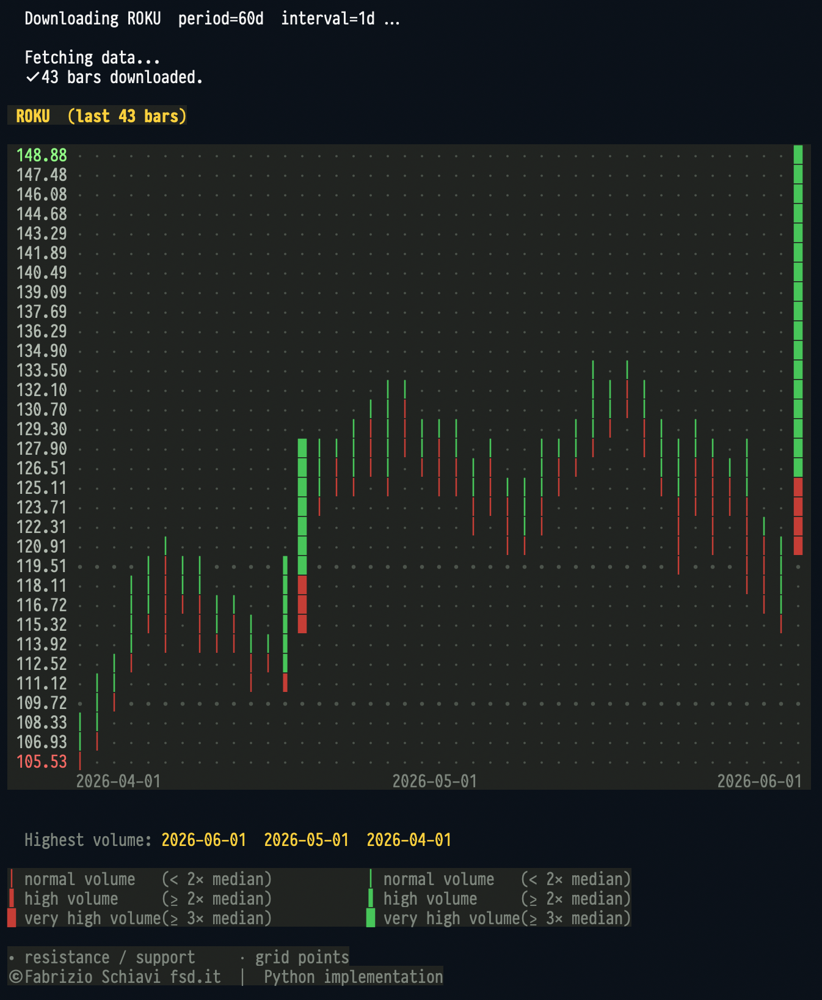

# Terminal Trading Chart



A terminal-based trading chart that visualizes price action with volume-weighted buy/sell pressure. Each candlestick is displayed as a vertical column where **green (top)** represents buying pressure and **red (bottom)** represents selling pressure, with glyph thickness indicating volume intensity.

Based on the original concept by [Fabrizio Schiavi](https://fsd.it/) designed in 2016.
Developed using Claude and Deepseek AI.

## Features

- Real-time price data from Yahoo Finance
- Color-coded buy/sell pressure (green top = buying, red bottom = selling)
- Volume-weighted glyphs (thicker = higher volume)
- Automatic date labels (start/middle/end of period)
- Support and resistance level detection
- Works in any terminal with ANSI color support

## Installation

### Prerequisites

- Python 3.8 or higher
- pip package manager

### Install required libraries

```bash
pip install yfinance pandas
```

### Download the script

```bash
curl -O https://raw.githubusercontent.com/fabrizioschiavi/terminal-trading-chart/terminal_chart.py
chmod +x terminal_chart.py
```

## Usage

### Basic syntax

```bash
python terminal_chart.py [TICKER] [PERIOD] [INTERVAL]
```

### Examples

```bash
# Bitcoin vs Euro - last 60 days, daily candles
python terminal_chart.py BTC-EUR 60d 1d

# Apple stock - last 90 days, daily candles
python terminal_chart.py AAPL 90d 1d

# S&P 500 - last 6 months, weekly candles
python terminal_chart.py ^GSPC 6mo 1wk

# Euro/USD Forex - last 30 days, hourly candles
python terminal_chart.py EURUSD=X 30d 1h

# Demo mode (synthetic data, no internet required)
python terminal_chart.py DEMO
```

## Parameters

### TICKER

The financial instrument symbol. See [Finding Tickers](#finding-tickers) below.

### PERIOD

Valid period strings:

| Period | Description |
|--------|-------------|
| `1d` | 1 day |
| `5d` | 5 days |
| `1mo` | 1 month |
| `3mo` | 3 months |
| `6mo` | 6 months |
| `1y` | 1 year |
| `2y` | 2 years |
| `5y` | 5 years |
| `10y` | 10 years |
| `ytd` | Year to date |
| `max` | Maximum available |

### INTERVAL

Valid interval strings (some have Yahoo Finance limits):

| Interval | Max Period | Description |
|----------|------------|-------------|
| `1m` | 7 days | 1 minute |
| `2m` | 60 days | 2 minutes |
| `5m` | 60 days | 5 minutes |
| `15m` | 60 days | 15 minutes |
| `30m` | 60 days | 30 minutes |
| `60m` | 730 days | 60 minutes (1 hour) |
| `90m` | 60 days | 90 minutes |
| `1h` | 730 days | 1 hour |
| `4h` | 730 days | 4 hours |
| `1d` | Unlimited | 1 day |
| `5d` | Unlimited | 5 days |
| `1wk` | Unlimited | 1 week |
| `1mo` | Unlimited | 1 month |
| `3mo` | Unlimited | 3 months |

**Note:** When using intraday intervals (1m, 2m, 5m, 15m, 30m, 60m, 90m), the period is automatically capped to the maximum allowed by Yahoo Finance.

## Finding Tickers

Yahoo Finance does not provide an official complete ticker list, but here are reliable resources:

### Recommended Ticker Lists

1. **[Yahoo Finance Ticker Lookup](https://finance.yahoo.com/lookup/)** - Official search tool
2. **[NYSE Listed Securities](https://www.nyse.com/listings_directory/stock)** - Official NYSE directory
3. **[All the tickers of the world](https://github.com/adanos-software/free-ticker-database)** - Free Ticker Database

### Common Ticker Formats

| Asset Class | Format | Examples |
|-------------|--------|----------|
| **US Stocks** | Direct symbol | `AAPL`, `MSFT`, `GOOGL`, `TSLA`, `AMZN` |
| **Crypto** | `SYMBOL-USD` or `SYMBOL-EUR` | `BTC-USD`, `ETH-USD`, `BTC-EUR` |
| **Forex** | `CURRENCYX` or `CURRENCY=X` | `EURUSD=X`, `GBPUSD=X`, `JPY=X` |
| **Indices** | `^SYMBOL` | `^GSPC` (S&P 500), `^IXIC` (NASDAQ), `^DJI` (Dow Jones) |
| **European Stocks** | Add exchange suffix | `NESN.SW` (Nestlé), `SAP.DE` (SAP) |
| **Mutual Funds** | Add `-X` suffix | `VFIAX-X`, `FXAIX-X` |

### Tips for finding tickers

1. Visit [Yahoo Finance](https://finance.yahoo.com/)
2. Search for your asset in the search box
3. The ticker will appear in the URL or search results
4. For international stocks, use the exchange code (e.g., `.L` for London, `.DE` for Germany)

## Understanding the Chart

### Color Coding

- **🟢 GREEN cells (top)** = Buying pressure (close near high)
- **🔴 RED cells (bottom)** = Selling pressure (close near low)

### Glyph Thickness (Volume Indication)

| Glyph | Unicode | Volume Level | Description |
|-------|---------|--------------|-------------|
| `│` | U+2502 | Normal | Volume < 2× median |
| `┃` | U+2503 | High | Volume ≥ 2× median |
| `█` | U+2588 | Very High | Volume ≥ 3× median |

### Other Symbols

- `⋅` (U+22C5) = Grid point (background)
- `∙` (U+2219) = Resistance or support level detected

### Reading the Chart

Each column represents one candlestick:
- **Height** = High-Low range
- **Green portion** = Percentage of buying volume
- **Red portion** = Percentage of selling volume
- **Glyph thickness** = Total volume intensity

A tall green column with thick glyph indicates strong buying with high volume (bullish signal).
A tall red column with thick glyph indicates strong selling with high volume (bearish signal).

## Troubleshooting

### "Empty DataFrame" error

**Solution 1:** Update yfinance
```bash
pip install yfinance --upgrade
```

**Solution 2:** Use a different interval/period combination
```bash
# Try daily instead of intraday
python terminal_chart.py AAPL 30d 1d
```

**Solution 3:** Check ticker format
```bash
# Try different formats
python terminal_chart.py BTC-USD 60d 1d   # instead of BTC-EUR
```

### "Missing columns" error

**Cause:** Yahoo Finance sometimes changes response format

**Solution:** Clear cache and retry
```bash
rm -rf ~/.yfinance_cache
python terminal_chart.py AAPL 60d 1d
```

### Terminal shows garbled characters

**Solution:** Ensure your terminal supports UTF-8 and ANSI colors

- **macOS/Linux:** Most terminals work out of the box
- **Windows:** Use Windows Terminal or enable VT100 emulation:
  ```powershell
  # Run in PowerShell as Administrator
  Set-ItemProperty -Path "HKLM:\SYSTEM\CurrentControlSet\Control\Terminal Server\WinStations\console" -Name "VirtualTerminalLevel" -Value 1
  ```

### Slow download or timeout

**Solution:** Use longer intervals or shorter periods
```bash
# Use weekly instead of daily
python terminal_chart.py AAPL 6mo 1wk
```

## Advanced Usage

### Custom chart height

Edit the `chart_height` parameter in the `render()` function call (default is 32 rows).

### Save output to file

```bash
python terminal_chart.py AAPL 60d 1d > chart.txt
```

### Create alias for quick access

Add to your `~/.bashrc` or `~/.zshrc`:
```bash
alias chart='python /path/to/terminal_chart.py'
```

Then use:
```bash
chart AAPL 60d 1d
```

## Credits

- Original concept: [Fabrizio Schiavi (fsd.it)](https://github.com/fabrizioschiavi)
- Data provider: Yahoo Finance via yfinance library
- Python implementation: Terminal Trading Chart project

## License

MIT License - Free for personal and commercial use

## Contributing

Contributions welcome! Please submit issues and pull requests on GitHub.

---

**Happy trading!**
```
